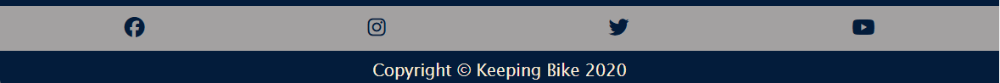
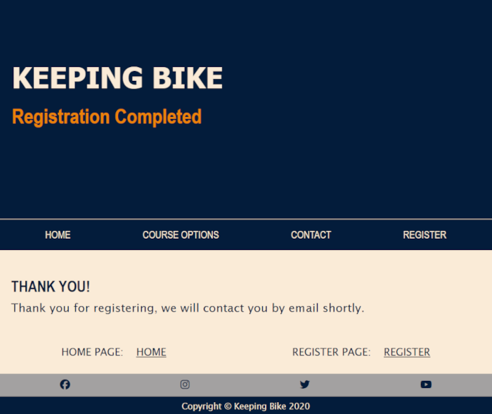
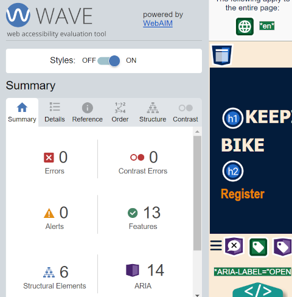
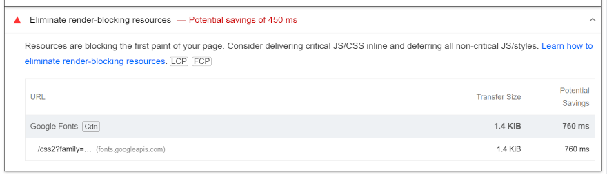
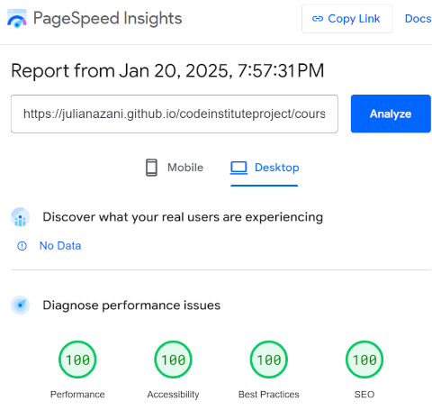
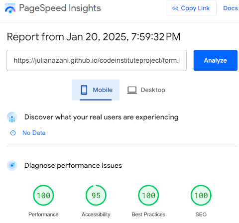

# KEEPING BIKE

This HTML and CSS project is about a website for selling bicycle mechanic courses.  
Keeping Bike is the name of the company.  
This first project of mine is to create a website for a special person, my husband Alencar. He is a bicycle mechanic and in the future he may work as an instructor, selling bike mechanics courses and providing mentoring.  
He helped choose the more technical images (the 3 in the main into the index.html), as they represent a more specific type of bike knowledge.  
The image of the transmission kit, for example, is something that relates to the text, as it is a new kit on the current market.  
The blue color that predominates on the website is his favorite color. And when I talked about the project with him, it gave me an idea of ​​what it will be like in the future when I have to design websites for my future clients.  

  

Other colors used frequently on the site: Bege (#faebd7) and orange rgb(235, 131, 5).  

Website to show responsiveness: https://ui.dev/amiresponsive  

  

Keeping Bike website is for presenting what the company offers. In addition to being a presentation tool, is also a way to obtain data from potential customers.  

## Features  

### Index.html  

Into the header we may see the name of the company and in orange we may check what the company sells (Bike mechanic course). To provide clarity to website users.  
In the navegation the users are able to go to courses page (for to see more details about each course), contact section, form to register and to return to home page.  
I added some formatting to the CSS so that when the cursor hovers over the links, the mouse arrow changes to the shape of a hand and changes the color to orange.  
Changing the menu to implement drop-down functionality to save space on smaller screens was inspired by the Love Running website developed in the course.  

  

In the first presentation, users who identify with the company's proposal will remain on the website.  
In main section the users will see more about what the Keeping Bike is offering.  
The illustrations refer to bicycle parts.  

  

I put the same filter on all the images on the main page so that this first page would be standardized. I had a lot of difficulty putting them in the appropriate resolution, many errors appeared when I used the Lighthouse extension, but in the end I managed to improve and the score improved.  

**Before:**  

**After:**  

At the end of the main page, users can see a link that directs them to another page (to know more about the course options).  

  

Into the footer we have the social media that opens on a separate page.  
The icons are from the awesome website.  
The copyright was made based on the first website developed in the Five Day Coding Challenge and the Coders Coffeehouse website (Code Institute example sites).

  

### Courses.html  

More details about the courses offered by Keeping Bike can be found on this page.  
The orange header says "courses" so users know which page they are on.  
The navigation bar is available for all pages.   
The first image chosen is from our personal collection. It was a group spin in Ticknock (Ireland).  

  

About the layout, the image overlay on this page was completely inspired by the Coders Coffeehouse site.  
When explaining the basic course, a common image (biker's view) was chosen. When describing the professional course, an image of a professional athlete was chosen. Seeking to illustrate the information with the most appropriate images.  
The link near the end of the main section directs users to the registration page.  

  

To finish the main part of this page we find the contact information.  
Initially I had placed the contact section on the first page, but according to mentor David's guidance (because of the menu layout I created), it was better to change it to the courses page.  
The social media footer remains on this page near the contact section as they are also forms of contact.  

  

### Form.html  

Using the form, when obtaining user information, it will be easier to make personalized contact in the future.  
When choosing a background image for the form, to avoid it looking too cluttered, I opted to make the header simpler, but keeping the color pattern.  
The footer remains the same as on all other pages.  

  

### Formresponse.html  

Among many of my mentor's instructions, I thought it was great to create a response page for the form. Users will know that the registration was successful.  
There are also 2 links below, one directing them to the home page and the other to return to the registration page.  

  

## Testing  

* I tested that this page works in different browsers: Chrome, Safari, Microsoft Edge.    
* I confirmed that this project is responsive, looks good and functions on all standard screen sizes using the devtools device toolbar.  
* I confirmed that the navigation, header, informations, course options, register, form response are all readable and easy to understand.  
* I have confirmed that the form works: it requires input in the main fields, it will only accept an email in the email field and numbers in the age field, the submit and reset buttons work.

### Validator Testing

* HTML - No errors were returned when passing through the official W3C validator.  
* CSS - No errors were found when passing through the official (Jigsaw) validator.  
* Accessibility - I confirmed thet the colors and fonts chosen are easy to read and accessible by running it through lighthouse in devtools and Wave Evolution Tool.  

I did not save the screen when the pages was having contrasts problems. I fixed it and when I checked again, these problems needed to be solved yet (Wave Evolution Tool - index.html):

  

After solving some issues with tags and missing aria label (Wave Evolution Tool - index.html):  

  

**Wave Tool Results (courses.html, form.html and formresponse.html)**  

  
  
  

In addition to the great difficulty I had in finding the best resolutions for the images (as described previously), I also had this problem (With that, I chose not to use the Google font link in the CSS):  

 

**LIGHTHOUSE RESULTS (Desktop and Mobile):**  

* **INDEX PAGE**

  
  

* **COURSES PAGE**

  
  

* **FORM PAGE**

  
  

* **FORM RESPONDE PAGE**

  
  

## Deployment  

The site was deployed to GitHub pages.  
The steps to deploy are as follows:
* In the GitHub repository, navigate to the Settings tab;  
* From the source section drop-down menu, select the Master Branch;  
* Once the master branch has been selected, the page will be automatically refreshed with a detailed ribbon display to indicate the successful deployment.  
The live link can be found here: https://julianazani.github.io/codeinstituteproject/  

## Credits  

### Content  
* The text was helped by my husband, as he knows a lot about bicycles.  
* My mentor David Bowers, who gave me a lot of tips in all the mentoring sessions, was patient and guided me.  
* The Code Institute classes, as the websites presented and explained were the basis for my learning.  
* The icons in the footer were taken from Font Awesome as I learned on the Love Running website.  

### Media  
* Some images were from my personal collection: parts.webp and winterspin.webp
* I found the other images on Google Image (As I took the images at the beginning of the project, today I can't find the link for all of them). I chose the Creative Commons licenses search tool:  
bikeonthestreet.webp - https://images.app.goo.gl/oZ1XtG1eJafdcnjZA  
axle.webp - https://images.app.goo.gl/GNoTdCvDWksqShZY7  
mansittingbesidebike.webp - https://images.app.goo.gl/mTtbyJMkuwmuF3C79  
